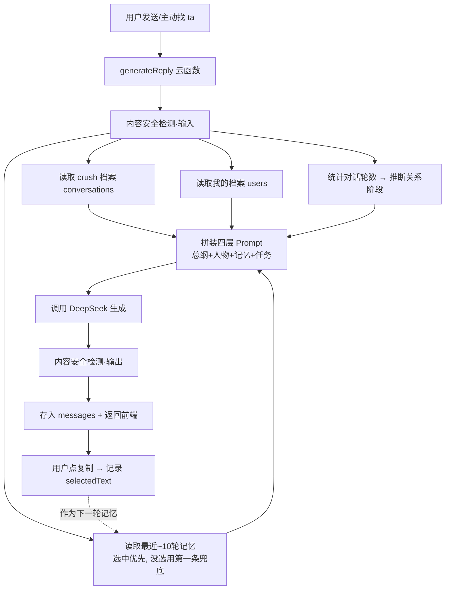

# 阶段 4 · 对话自然度升级（「灵魂共振」版）

> 最后更新：2026-05-31
> 一句话：让 AI 的回复从「一看就是机器人」变成「像你本人在用心聊天」。

---

## 一、为什么要做这次升级（背景）

上线 demo 试用后，我们发现 AI 生成的回复有三个硬伤，直接影响"能不能真的帮到用户撩到人"：

| # | 问题 | 用户的真实感受 |
|---|------|----------------|
| 1 | **一看就是 AI 写的** | 太工整、太客套、爱用感叹号和"哈哈哈"，发出去对方一眼识破 |
| 2 | **没有上下文** | 每次生成都是"失忆"的——它不知道你俩前面聊了啥，回复经常接不上 |
| 3 | **对双方了解太少** | 系统只知道 crush 的昵称/性别/星座，连你自己是谁都不知道，巧妇难为无米之炊 |

**根因分析**：
- 问题 1 的根因是 **prompt 太弱**。老 prompt 只说了一句"帮我回复 crush 的消息"，没有告诉 AI"什么叫聊得好"，AI 只能按它默认的"AI 腔"来写。
- 问题 2 的根因是 **系统没有记忆**。每次调用 AI 都只把"对方这一句话"丢过去，前面几十轮对话全部丢失。
- 问题 3 的根因是 **输入信息太少**。资料字段少、录入也麻烦，用户懒得填，AI 自然没素材。

这三件事是连环的：信息够多（问题3）→ 记得住（问题2）→ 再配一套好的聊天方法论（问题1）→ 回复才自然。所以这次一起做。

---

## 二、优化思路（为什么这么解，有没有更好的方案）

### 2.1 针对"AI 腔"——给它一套聊天方法论（三层 Prompt）

**思路**：与其每次零散地提要求，不如给 AI 一个固定的"聊天世界观"统领所有对话。我们把产品经理总结的恋爱聊天方法论写成 **总纲 Prompt**：

> 一段舒适的关系 ≈ **60% 灵魂共振 + 40% 生活渗透**，拆成四个区：
> 日程(20%·安全区) / 兴趣(20%·舒适区) / 观点三观(30%·深水区) / 情感需求(30%·进阶区)。

再加一套"像真人"的铁律（口语化、留钩子、不滥用感叹号、不报菜名）。

**最终结构是三层叠加**：

```
第一层 总纲   —— 聊天哲学 + 关系阶段策略 + 像真人的铁律（每次都带）
第二层 人物   —— 我 和 crush 的详细资料（每次都带，只带填了的）
第三层 记忆   —— 最近 10 轮对话原文（有就带）
第四层 任务   —— 这一轮 ta 说了啥 + 选哪个风格
```

**备选方案对比**：
- ❌ *只在每条建议后面加"请自然点"* —— 治标不治本，AI 还是不知道"自然"长什么样。
- ❌ *把方法论做成 5 种风格里的一种* —— 方法论是地基，应该统领全部风格，而不是和"幽默/高冷"并列。
- ✅ *做成独立总纲层* —— 风格只管语气，总纲管"怎么把天聊下去"，两者正交、互不打架。**采用**。

### 2.2 针对"没上下文"——三级记忆，而不是全量记忆

**思路**：人脑记对话也不是逐字全记，而是"最近的记得清 + 远的记个大概 + 对方是谁记一辈子"。我们照这个分三级：

| 级别 | 记什么 | 怎么用 | 更新频率 |
|------|--------|--------|----------|
| 一级·近期原文 | 最近约 10 轮的原话 | 直接拼进 prompt | 实时 |
| 二级·阶段摘要 | 每 20 轮压缩成一段话 | 取最近两段拼进 prompt | 每 20 轮 |
| 三级·人物画像 | 从对话里沉淀的 crush 特征 | 永远带在 prompt | 总结时顺带更新 |

**为什么是"10 轮原文 + 20 轮一总结"？**
- 全量塞进去：又慢又贵，而且 AI 会被无关的旧消息带偏。
- 只记摘要不留原文：丢掉了语气和细节，回复会变得"宏观正确但具体尴尬"。
- 折中：近的留原文保证接得上，远的压成摘要防遗忘，人物特征永久留存。10 轮 / 20 轮是经验起步值，后续可调。

**备选方案对比**：
- ❌ *每 50 轮才总结一次*（PM 初版设想）—— 50 轮太长，中间这段全靠原文塞，prompt 会偏大；改成 20 轮更稳。
- ✅ *三级分层 + 20 轮总结* —— 兼顾效率和连贯。**采用**。

> ⚠️ 本阶段（Phase 1）先落地"一级近期原文"，二级摘要和三级画像放在 Phase 2，原因见第五节。

### 2.3 针对"信息太少"——团购式标签录入 + 双方都建档

**思路**：信息少一半是因为字段少，另一半是因为**录入太累**（一个个下拉框选到烦）。参考团购 App 的好评界面：把要填的内容**按类目铺成一排胶囊标签，点一下就选中**，还能"+ 自定义"，并给暗纹提示词降低填写门槛。

同时给"我自己"也建一份档案——AI 要模仿的是"你"，得知道你是谁、有啥爱好，才能找到和 crush 的共同点。

**两个关键约束（按 PM 要求）**：
1. **只有性别必填**，昵称留空自动用「crush」/「我」，其余全部选填——降低门槛，填多填少都能跑。
2. **prompt 只拼填了的字段**——没填的字段直接不出现，绝不写成"未知/未填"，免得 AI 反而去提"我还不知道你的星座呢"这种尴尬话。

**备选方案对比**：
- ❌ *继续用下拉选择器* —— 多选场景（爱好、性格）下拉很难用，且没有"自定义"。
- ✅ *胶囊标签（单选/多选）+ 自定义 + 暗纹提示* —— 一屏点选完成，符合团购式直觉。**采用**。

### 2.4 针对"选中兜底"（PM 补充点）

**问题**：要让记忆接上下文，得知道"你上一轮到底发了哪条建议"。但本产品是"AI 出建议→你复制去微信发"，我们没法 100% 确认你发了哪条，甚至你可能一条没点、自己改了再发。

**解法（分层兜底，保证记忆永不断档）**：
1. **强信号**：你点了某条的「复制」→ 视为"我要发这条"，记下来（复制 = 选中）。
2. **兜底**：某一轮你一条都没点 → 生成下一轮时，系统**自动拿这一轮的第一条建议**当作"你大概发了这个"来续上下文。
3. **跳过**：整轮生成失败、没有任何内容 → 直接跳过，不把空数据塞进记忆。

这样无论用户点不点，AI 都能拿到一条连贯的"我方发言"来续接，而又不会强迫用户做多余操作。

---

## 三、具体方案（这次改了什么）

### 3.1 数据库新增字段（微信云开发，字段可直接加，无需迁移）

**conversations（crush 档案）新增**：
`crushAge` 年龄段、`crushHobbies[]` 爱好、`crushRecentMentions` 最近提过、`crushPersonality[]` 性格、`crushChatStyle[]` 聊天风格、`knownDuration` 认识多久、`relationStage` 关系阶段、`metInPerson` 见面情况、`crushInsights` AI 沉淀的特征（Phase 2 用）。

**users（我的档案）新增**：
`gender` 性别、`age` 年龄段、`mbti`、`zodiac`、`hobbies[]` 爱好、`recentInto` 最近在追、`occupation` 职业、`city` 城市、`chatHabits[]` 聊天习惯。

**messages（每轮对话）新增**：
`selectedText` 我选中/复制的那条建议（`selectedIndex` 字段早就有，这次正式启用）。

### 3.2 改动清单

| 模块 | 改动 | 说明 |
|------|------|------|
| `generateReply` 云函数 | **重写 prompt** | 三层结构 + 读双方档案 + 读最近 10 轮记忆 + 关系阶段推断 |
| `chat` 聊天页 | **记录选中** | 点"复制"即记为选中，写回该轮（本地+数据库） |
| `crush-edit` 页 | **整页重构** | 扩成完整档案，胶囊标签录入，只有性别必填 |
| `me-edit` 页（新增） | **新页面** | "我的恋爱档案"，同款胶囊录入 |
| `me` 页 | **加入口** | 新增"我的恋爱档案 ›"一行 |
| `app.json` | 注册新页 | 加 `pages/me-edit/index` |

---

## 四、全流程图

### 4.1 用户视角（怎么用）

```
1. 我的 → 我的恋爱档案 → 点选性别(必填)/爱好/职业… → 保存
2. 首页 → 进入某个 crush → 头像进编辑 → 点选 ta 的爱好/性格/关系阶段… → 保存
3. 回到聊天页 → 粘贴 ta 发来的话 / 或点"主动找 ta" → 选风格 → 发送
4. AI 出建议 → 看中哪条点"复制" → 去微信粘贴发出
   （这一"复制"动作 = 告诉系统"我发了这条"，下次它就能接上）
5. 下一轮再聊 → AI 已经记得前面 10 轮 + 双方资料 → 回复更连贯更像你
```

### 4.2 系统视角（一次"生成回复"内部发生了什么）



纯文字版（怕图不渲染）：
> 发送 → 安全检测 → 同时读「crush档案 / 我的档案 / 对话轮数 / 最近10轮记忆」 → 拼成四层 prompt → 调 DeepSeek → 输出再安全检测 → 存库返回 → 用户复制时回写选中 → 这条选中又成为下一轮的记忆。

---

## 五、当前进度

### ✅ Phase 1 已完成（本次）—— 解决问题 1、3 和问题 2 的"短期记忆"

- [x] 三层 Prompt 总纲（灵魂共振哲学 + 关系阶段策略 + 像真人铁律）
- [x] 双方档案全部接入 prompt（只拼填了的字段）
- [x] 最近约 10 轮对话记忆（一级记忆）接入 prompt
- [x] 关系阶段自动推断（按标注/轮数）
- [x] crush-edit 整页重构为胶囊标签录入，只有性别必填
- [x] 新增 me-edit「我的恋爱档案」页 + 我的页入口
- [x] 点"复制"记录选中 + 没点时第一条兜底

### ⏳ Phase 2 待做 —— 解决问题 2 的"长期记忆"

- [ ] 新增 `summarizeMemory` 云函数：每 20 轮把对话压成一段摘要（二级记忆）
- [ ] 从对话中自动提取 crush 特征写入 `crushInsights`（三级记忆）
- [ ] prompt 接入二级摘要 + 三级画像

**为什么 Phase 2 单独拆出来**：摘要要额外调一次 AI、还要考虑何时触发、失败重试，复杂度和成本都更高；而 Phase 1 不改数据流就能立刻让回复质量上一个台阶，先验证效果再投入 Phase 2 更稳。

---

## 六、给产品经理的验收 & 部署说明

**部署（在微信开发者工具里）**：
1. 右键上传 `cloudfunctions/generateReply` 云函数（重新部署）。
2. 其余都是小程序前端改动，保存后直接预览即可，无需额外操作。
3. 数据库字段会在用户保存档案/聊天时自动写入，**不用手动建字段**。

**怎么验收效果**：
1. 先去「我的 → 我的恋爱档案」把自己资料填一填（至少选性别 + 两个爱好）。
2. 给一个 crush 填上爱好、性格、关系阶段。
3. 连续聊 4~5 轮，每轮看中一条就点复制。
4. 观察第 4、5 轮：AI 是否还记得前面聊的内容、是否会呼应你俩的爱好、语气是否不再"AI 腔"。

**对比验证**：可以拿同一句话，在"档案填满 vs 全空"两种情况下各生成一次，直观感受差距。
